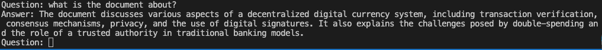

Using langchain library with basics in js. (splitting pdf files, creating chunks, converting vectors, using conversational chain in memory)

## Usage

##### Install dependencies.
```sh
npm install
```

##### Configure enviroments.
- Create `.env` document inside root of project (or change name of `.env.sample` to `.env`)
- Add your OpenAI API Key into `.env` (as `OPENAI_API_KEY=<your api key>`) 

##### Run project
```sh
npm run start
```

##### Enter your question to console
```sh
Question: what is the document about?
```



## Adding Documents
You can add your pdf files to `/documents` folder inside of root of folder. `bitcoin.pdf` is already included.
